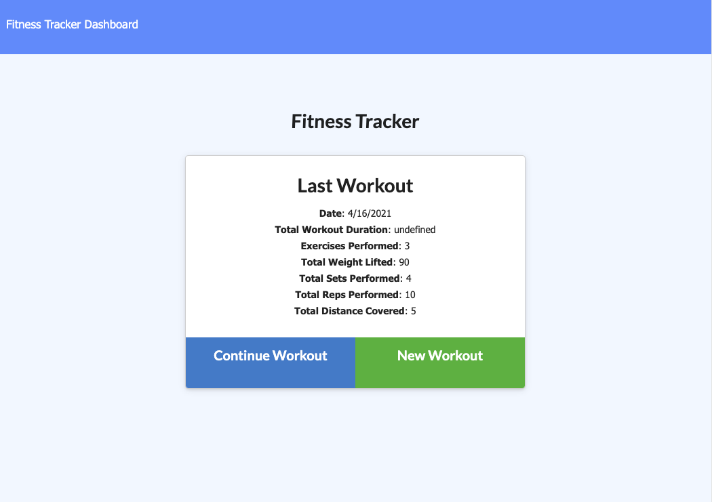

# fitness-tracker

## Description
With this fitness tracker the user can create custom workout plans and track them! This application utilizes Node JS, Express, and Mongoose DB. This app has full Create, Read and Update functionality for all entered info.

## Link to deployed App
* Click [here](https://limitless-meadow-66832.herokuapp.com/) to use!

* Create a workout regimen by entering the name under 'Enter Workout' 
* In new box, create new exercises by enter the name, quantity, and unit for each exercise as well as an optional note. _Example:_
    * _Exercise Name:_  'Squat'
    * _Weight:_ 'lbs'
    * _Sets:_ '# of sets'
    * _Reps:_ '# of reps'
    * _Duration:_ 'mins'
* Update exercises by clicking in text field to edit and clicking the 'Update!' button
* Repeat
* Get strong!

## Built With

* [JQuery](https://jquery.com/)
* [Node JS](https://nodejs.org/en/)
* [Mongoose](https://mongoosejs.com/)

## Authors

* **Jesse Willig** - *Initial work* - [jessewillig](https://github.com/jessewillig)
* [jessewillig@outlook.com](mailto:jessewillig@outlook.com)